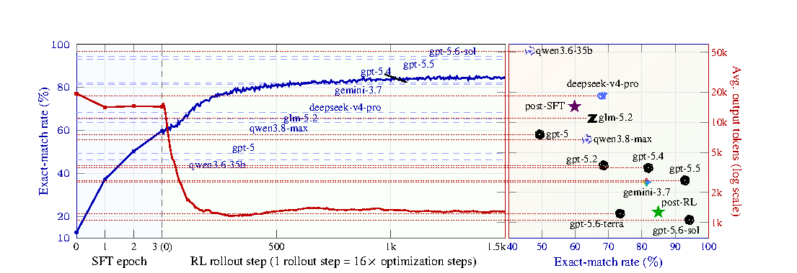

# LangMolDiode

<a id="readme-top"></a>

[](https://github.com/feiyang-cai/LangMolDiode/stargazers)
[](https://github.com/feiyang-cai/LangMolDiode/network/members)
[](https://github.com/feiyang-cai/LangMolDiode/issues)
[](https://arxiv.org/abs/2602.02320)
[](https://huggingface.co/datasets/ChemFM/MolLangData)
[](https://huggingface.co/ChemFM/LangMolDiode-Qwen3.5-4B-RL-LoRA)
[](environment.yml)

**LangMolDiode** trains a compact language model to translate detailed molecular
structure descriptions into SMILES. It combines reasoning SFT on
[MolLangData](https://github.com/TheLuoFengLab/MolLangData) with DAPO
reinforcement learning for accurate and token-efficient molecule generation.

## Results

We evaluate on the held-out MolLangData test set and the MolLangBench core and
extended generation sets. The table reports exact molecular match and average
output tokens. A match is determined from canonical isomeric SMILES, so
equivalent non-identical SMILES strings count as correct.

| Training stage | MolLangData exact (%) | Tokens | MolLangBench core exact (%) | Tokens | MolLangBench extended exact (%) | Tokens |
| --- | ---: | ---: | ---: | ---: | ---: | ---: |
| Base Qwen3.5-4B | 12.53 | 19,338 | 12.50 | 22,241 | 17.00 | 20,058 |
| Post-SFT | 59.84 | 14,304 | 47.00 | 16,362 | 57.00 | 13,162 |
| Post-RL | 84.99 | 1,264 | 65.00 | 1,430 | 72.00 | 1,067 |
| Best checkpoint per set | **85.19** | 1,277 | **71.50** | 1,273 | **77.50** | 1,294 |

The best-checkpoint row selects a checkpoint independently for each evaluation
set; it is not one shared checkpoint. Full validity and Tanimoto-similarity
results are reported in the MolLangData paper.



*Exact-match rate and average output length during SFT and RL on the 1,972-sample
MolLangData test set, reproduced from the MolLangData paper. One RL rollout step
contains 16 optimization steps.*

## Resources

The model and corpus repositories are private while the release is being
prepared and will be opened with the public release.

| Resource | Links | Description |
| --- | --- | --- |
| MolLangData | [GitHub](https://github.com/TheLuoFengLab/MolLangData) / [Hugging Face](https://huggingface.co/datasets/ChemFM/MolLangData) | Source molecule-description dataset |
| MolLangBench | [GitHub](https://github.com/TheLuoFengLab/MolLangBench) / [Hugging Face](https://huggingface.co/datasets/ChemFM/MolLangBench) | Core and extended evaluation sets |
| SFT training corpus | [Hugging Face](https://huggingface.co/datasets/ChemFM/LangMolDiode-SFT-Corpus) / [Box](https://clemson.app.box.com/folder/419341962405) | 75,666 verified reasoning traces and final answers |
| Merged post-SFT model | [Hugging Face](https://huggingface.co/ChemFM/LangMolDiode-Qwen3.5-4B-SFT) | Standalone SFT model used as the RL base |
| Post-SFT LoRA | [Hugging Face](https://huggingface.co/ChemFM/LangMolDiode-Qwen3.5-4B-SFT-LoRA) | SFT adapter for Qwen3.5-4B |
| Post-RL and selected LoRAs | [Hugging Face](https://huggingface.co/ChemFM/LangMolDiode-Qwen3.5-4B-RL-LoRA) | Final RL adapter and three per-set selected adapters |

## Installation

### Conda

The Conda environment supports corpus preparation, SFT, evaluation, and artifact
utilities. Create it from the repository root:

```bash
git clone https://github.com/feiyang-cai/LangMolDiode.git
cd LangMolDiode
conda env create -f environment.yml
conda activate langmoldiode
```

### Apptainer

The Apptainer environment is recommended for RL training. It is built from the
verl Docker image and keeps caches under the repository rather than
`~/.cache`.

```bash
bash scripts/bootstrap_upstream.sh
bash scripts/pull_verl_apptainer.sh
bash scripts/install_container_rdkit.sh
bash scripts/install_container_qwen35_fastpath.sh
bash scripts/install_megatron_bridge.sh
```

Run any command inside the prepared environment with:

```bash
bash scripts/run_in_apptainer.sh python -c "import verl; print('verl ready')"
```

Set `VERL_SIF` to reuse an existing image instead of pulling a new one.

## Curating the SFT Corpus

We use descriptions from the MolLangData training set as prompts, collect
reasoning traces and SMILES answers from stronger teacher models, retain only
answers that reconstruct the target molecule, deduplicate by target molecule,
and filter examples whose rendered Qwen sequence exceeds 40,960 tokens.

Given generation artifacts containing the prompt, model response, target
SMILES, and match result, build the reasoning SFT JSONL with:

```bash
python sft/prepare_sft_data.py \
  --input-root /path/to/generation_artifacts \
  --output data/sft_train.jsonl \
  --response-mode qwen_think \
  --require-match \
  --require-reasoning \
  --dedupe-key canonical_smiles

python sft/filter_sft_by_token_length.py \
  --input data/sft_train.jsonl \
  --output data/sft_train_max40960.jsonl \
  --rejected-output data/sft_train_over40960.jsonl \
  --tokenizer-name Qwen/Qwen3.5-4B \
  --max-length 40960 \
  --no-local-files-only
```

The verified corpus is provided on [Hugging Face](https://huggingface.co/datasets/ChemFM/LangMolDiode-SFT-Corpus)
and [Box](https://clemson.app.box.com/folder/419341962405). To recreate the
training JSONL directly from the Hugging Face release:

```bash
python sft/export_sft_corpus.py \
  --dataset ChemFM/LangMolDiode-SFT-Corpus \
  --output data/sft_train_max40960.jsonl
```

Authenticate with `hf auth login` first while the corpus is private. The
exporter also accepts local Parquet shards through `--data-files`.

Every released row passed an independent RDKit molecular-equivalence check.

## SFT Training

Launch the three-epoch, eight-GPU LoRA training job from an allocated GPU node:

```bash
TRAIN_JSONL=data/sft_train_max40960.jsonl \
EVAL_JSONL=/path/to/eval.jsonl \
OUTPUT_DIR=outputs/langmoldiode_sft \
NPROC_PER_NODE=8 \
bash scripts/run_sft.sh
```

The launcher accepts environment overrides for sequence length, batch size,
gradient accumulation, learning rate, evaluation, logging, and checkpoint
frequency.

## RL Training

First convert the MolLangData training prompts and the three evaluation sets to
verl Parquet files, then apply the prompt-token filter:

```bash
python -m rl.prepare_data \
  --train-jsonl /path/to/train.jsonl \
  --val-jsonl /path/to/mollangdata_test.jsonl \
  --bench-test-jsonl /path/to/mollangbench_core.jsonl \
  --bench-extended-jsonl /path/to/mollangbench_extended.jsonl \
  --output-dir data/verl

python rl/filter_prompt_tokens.py \
  --model /path/to/merged_sft_model \
  --input data/verl/train.parquet \
  --output data/verl/train_maxprompt2048.parquet \
  --max-prompt-length 2048
```

Launch DAPO inside the prepared Apptainer environment:

```bash
MODEL_PATH=/path/to/merged_sft_model \
TRAIN_FILE=data/verl/train_maxprompt2048.parquet \
VAL_FILE=data/verl/val_mollangbench_combined.parquet \
RUN_NAME=langmoldiode_dapo \
bash scripts/run_in_apptainer.sh scripts/run_rl.sh
```

The launcher uses vLLM rollout, Megatron-Bridge LoRA optimization, DAPO dynamic
sampling, token-level policy loss, rollout correction, and the molecular reward
in `rl/reward.py`. Review `scripts/run_rl.sh` for all configurable environment
variables before a full-scale run.

## Contact

For bugs, feature requests, or reproducibility questions, please
[open a GitHub issue](https://github.com/feiyang-cai/LangMolDiode/issues).
For research questions, contact **Feiyang Cai** at
[feiyang@clemson.edu](mailto:feiyang@clemson.edu).

## Citation

LangMolDiode is presented as the language-conditional molecule-generation study
in the MolLangData paper. Please cite:

```bibtex
@article{MolLangData,
  title={A Large-Scale Dataset for Molecular Structure-Language Description via a Rule-Regularized Method},
  author={Cai, Feiyang and He, Guijuan and Hu, Yi and Wang, Jingjing and Luo, Joshua and Zhu, Tianyu and Pilla, Srikanth and Li, Gang and Liu, Ling and Luo, Feng},
  year={2026},
  journal={arXiv preprint arXiv:2602.02320},
}
```

<p align="right">(<a href="#readme-top">back to top</a>)</p>
